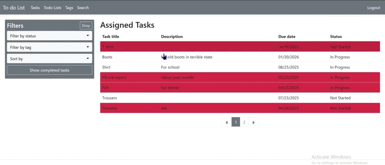
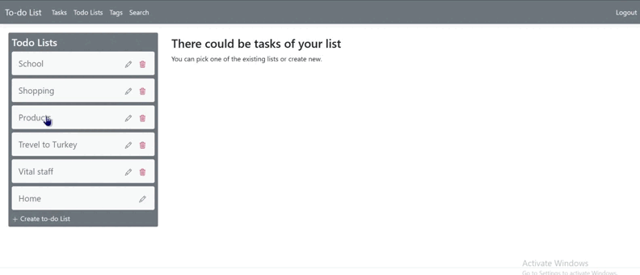
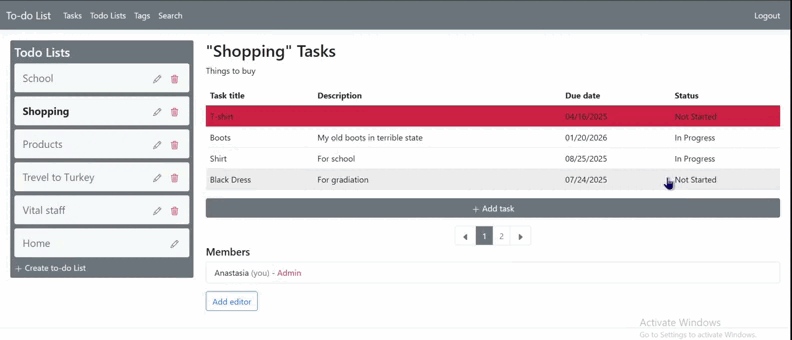
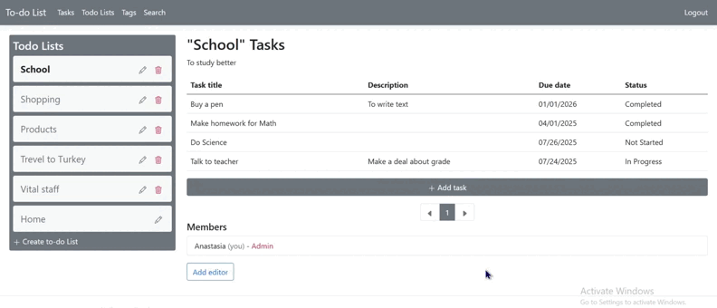
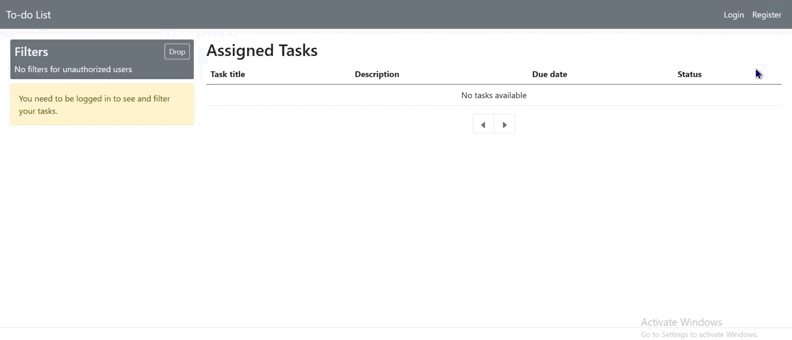
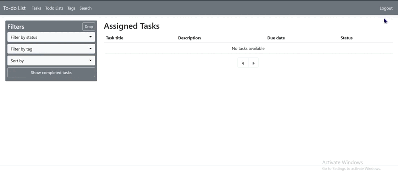

# To-do List Web Application

Web Application has such functions:
- Review all assigned tasks and filter them by: status, tag and due date. Also to sort them and see next/previous page
- Check to-do lists in navigation menu and create/edit/delete them. 
- See tasks in specific to-do list
- Manage tags and comments in specific task
- Assign task to another user
- Add/remove editors to to-do lists
- Authenticate/Authorize
- Change passwored in case user forgot it

## Web Application demonstration

### Tasks filtration and pagination

### CRUD operations with to-do lists and tasks

### Assign task to another user

### Add/remove editor to list

### Registration and Login

### Forgot password and Logout 

## Backend

Application has three layers:
- [UI](./TodoListApp.WebApp) (ASP.NET WEB APP)
- [API](./TodoListApp.WebApi) (ASP.NET WEB API)
- [Database](./TodoListApp.Database) (Class Libarary)

And additional two projects:
- [API Client](./TodoListApp.ApiClient) (Class Libarary)
- [API Models](./TodoListApp.WebApi.Models) (Class Libarary)

 All custom services and ASP.NET services were used in project with help of DI container. So services were injected and were used as interfaces to follow dependency inversion. Dependencies were added to service collection with help of extension methods in classes [ServiceCollectionExtension (API)](./TodoListApp.WebApi/Extensions/ServiceCollectionExtension.cs) and [ServiceCollectionExtension (APP)](./TodoListApp.WebApp/Extensions/ServiceCollectionExtension.cs) 

In this project Serialog were used for logging to track user's actions in console. Serialog were configured to host of API and APP in extension methods of the classes [HostExtension (API)](./TodoListApp.WebApp/Extensions/HostExtension.cs) and [HostExtension (APP)](./TodoListApp.WebApi/Extensions/HostExtension.cs). 

Since in the project three layers, there are different models for all of them. So it was necessary to provide [ModelsExtension (API)](./TodoListApp.WebApi/Extensions/ModelsExtension.cs) and [ModelsExtension (APP)](./TodoListApp.WebApp/Extensions/ModelsExtension.cs) to easily and without dublication convert objects from one type to another.  

### WEB Application (UI)
UI layer has three main Controllers:
- [Account](./TodoListApp.WebApp/Controllers/AccountController.cs)
- [TodoLists](./TodoListApp.WebApp/Controllers/TodoListsController.cs)
- [Tasks](./TodoListApp.WebApp/Controllers/TasksController.cs)

[AccountController](./TodoListApp.WebApp/Controllers/AccountController.cs) gives user possibility to register, login, change password and log out. All of it were made with help of ASP.NET Entity Framework Core Identity tools such as UserManager and SignInManager. Token is generated after authorization and is stored in cookies during hour or seven days (in case user check "remember me"). For making requests to API through API Client, token is necessery, because without valid token in header, response would be with status code 401. [AuthHeaderHandler](./TodoListApp.WebApp/Handlers/AuthHeaderHandler.cs) (inherited from DelegatingHandler) checks if token is valid and put it to header of request. It uses [JwtTokenGenerator](./TodoListApp.WebApp/Helpers/JwtTokenGenerator.cs) to generate new token in case token in cookies expired, but in the same time user checked "Remember me" checkbox. Also Account controller works with [EmailSender](./TodoListApp.WebApp/Services/EmailSender.cs) to sent messages after registration (user can confirm email) and also to use functionality "Forgot Password" (change password after email confirmation). All forms have validation of inputs, so user instantly sees an error if there is a mistake. When user tries to use method which has Authorize attribute - user is redirected to Login. 

TodoLists and Tasks controllers have exception handling and logging. Both of them use API client services to sent requests to API. With help of UserManager some methods can check user for existance or get current user. [TodoListsController](./TodoListApp.WebApp/Controllers/TodoListsController.cs) uses [TodoListApiClientService](./TodoListApp.ApiClient/Services/TodoListApiClientService.cs) to manipulate with to-do lists. TodoLists controller has CRUD operations with to-do lists and deleting/adding operations with editors. [TasksController](./TodoListApp.WebApp/Controllers/TasksController.cs) uses [TaskApiClientService](./TodoListApp.ApiClient/Services/TaskApiClientService.cs) to manipulate with tasks. Tasks controller contains CRUD operations. Index action has filtration, sorting and pagination of all tasks, assiggned to user. There are an actions for managing comments/tags, assign of the task, searching tasks and changing status of the task. 

Also there are [Components](./TodoListApp.WebApp/Components) in UI layer for [serching users](./TodoListApp.WebApp/Components/SearchUsersViewComponent.cs), [getting tasks by tag](./TodoListApp.WebApp/Components/GetTasksByTagViewComponent.cs), [task menu](./TodoListApp.WebApp/Components/TaskMenuViewComponent.cs) and [to-do list menu](./TodoListApp.WebApp/Components/TodoListMenuViewComponent.cs). These components were created to avoid duplication.

### WEB API
API layer provides interaction with TodoListDB and follows REST architectural style.  
There are three controllers:
- [BaseController](./TodoListApp.WebApi/Controllers/BaseController.cs)
- [TodoListsController](./TodoListApp.WebApi/Controllers/TodoListsController.cs)
- [TodoListsController](./TodoListApp.WebApi/Controllers/TodoListsController.cs)

[Base](./TodoListApp.WebApi/Controllers/BaseController.cs) controller has method to operate with service successfully. [TodoLists](./TodoListApp.WebApi/Controllers/TodoListsController.cs) and [Tasks](./TodoListApp.WebApi/Controllers/TodoListsController.cs) controllers inherited from [Base](./TodoListApp.WebApi/Controllers/BaseController.cs) controller and have documentations. All actions have attributes for spacifing which status codes can be returnd as response. Also every action has attribute which difines route and http method.

In [ServiceCollectionExtension](./TodoListApp.WebApi/Extensions/ServiceCollectionExtension.cs) was configured JWT Bearer to securely exchange data between API and APP. Because of JWT Bearer Authorization, only authorizezd users can successfuly use API.

### Databases
In this project were used Microsoft SQL Server. Application has two databases: TodoListsDB and UsersDB (identity). Connection Strings are stored in secret.json. In this project was used ORM Entity Framework Core for code-first approach. TodoListsDB stores to-do lists and tasks and has such entities: [TodoList](./TodoListApp.Database/Entities/TodoListEntity.cs), [Task](./TodoListApp.Database/Entities/TaskEntity.cs) and [Status](./TodoListApp.Database/Entities/StatusEntity.cs). UsersDB stores information about users and contains Identity tables, but instead of IdentityUser was used [ApplicationUser](TodoListApp.WebApp/Models/AuthenticationModels/ApplicationUser.cs) which is inherited from IdentityUser.

## FrontEnd

### Views

### Java Script

### Bootstrap
